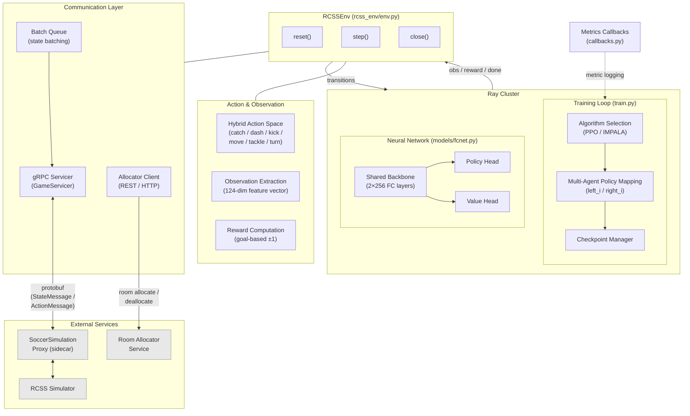

# rcss-rl-ray

Multi-agent reinforcement learning for **RoboCup Soccer Simulation** (RCSS)
built on top of [Ray](https://ray.io/) and [RLlib](https://docs.ray.io/en/latest/rllib/).

## Architecture

### Keywords

- **Multi-Agent Reinforcement Learning (MARL)** — simultaneous training of multiple soccer-playing agents
- **RoboCup Soccer Simulation (RCSS)** — 2D simulated soccer competition environment
- **Ray / RLlib** — distributed RL training framework (PPO, IMPALA)
- **Hybrid Action Space** — discrete action-type selection combined with continuous parameters
- **gRPC** — high-performance RPC for real-time agent–simulator communication
- **Gymnasium MultiAgentEnv** — standard multi-agent environment interface

